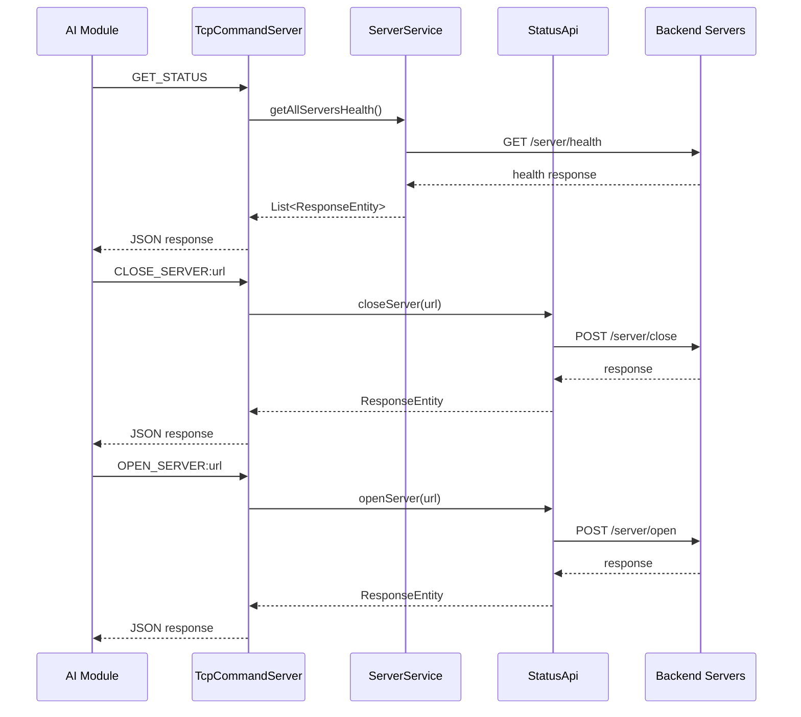
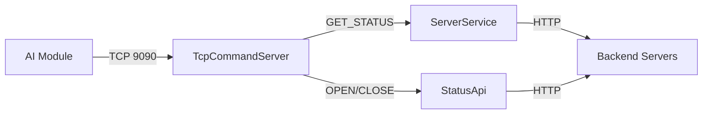

# TCP Implementation - Load Balancer

## Overview

TCP Server cho phép AI module giao tiếp với Load Balancer để:
- Lấy trạng thái các backend servers
- Điều khiển đóng/mở servers

## Architecture



## Components

| Component | File | Chức năng |
|-----------|------|-----------|
| TcpCommandServer | `tcp/TcpCommandServer.java` | Lắng nghe TCP port 9090, xử lý commands |
| ServerService | `service/feature/ServerService.java` | Quản lý danh sách servers, health check |
| StatusApi | `service/api/StatusApi.java` | Gọi API đóng/mở server |

## TCP Protocol

### JSON Request Format

| Action | Request JSON |
|--------|--------------|
| `PING` | `{"action": "PING"}` |
| `GET_STATUS` | `{"action": "GET_STATUS"}` |
| `OPEN_SERVER` | `{"action": "OPEN_SERVER", "serverUrl": "http://localhost:8081"}` |
| `CLOSE_SERVER` | `{"action": "CLOSE_SERVER", "serverUrl": "http://localhost:8081"}` |

### JSON Response Format

**GET_STATUS Response:**
```json
{
  "status": "OK",
  "servers": [
    {
      "url": "http://localhost:8081",
      "statusCode": 200,
      "health": {
        "cpuUsagePercent": 45.5,
        "memoryUsagePercent": 60.2,
        "avgProcessingTimeSec": 0.15,
        "currConnections": 10,
        "isOpen": true
      }
    }
  ]
}
```

**OPEN_SERVER / CLOSE_SERVER Response:**
```json
{
  "status": "OK",
  "message": "Server http://localhost:8081 opened",
  "serverUrl": "http://localhost:8081"
}
```

**Error Response:**
```json
{
  "status": "ERROR",
  "message": "Error description"
}
```

**PING Response:**
```json
{
  "status": "OK",
  "message": "PONG"
}
```

## Configuration

```properties
# application.properties
loadbalancer.tcp.port=9090
```

## Usage Example

```python
import socket
import json

def send_request(request_data):
    """Send JSON request to Load Balancer TCP server"""
    with socket.socket(socket.AF_INET, socket.SOCK_STREAM) as s:
        s.connect(("localhost", 9090))
        json_str = json.dumps(request_data)
        s.sendall((json_str + "\n").encode())
        response = s.recv(4096).decode().strip()
        return json.loads(response)

# Ping
response = send_request({"action": "PING"})
print(response)  # {"status": "OK", "message": "PONG"}

# Get status of all servers
response = send_request({"action": "GET_STATUS"})
for server in response["servers"]:
    print(f"{server['url']}: {server['statusCode']}")
    if "health" in server:
        print(f"  CPU: {server['health']['cpuUsagePercent']}%")
        print(f"  Memory: {server['health']['memoryUsagePercent']}%")
        print(f"  IsOpen: {server['health']['isOpen']}")

# Close server
response = send_request({
    "action": "CLOSE_SERVER",
    "serverUrl": "http://localhost:8081"
})
print(response["message"])

# Open server
response = send_request({
    "action": "OPEN_SERVER",
    "serverUrl": "http://localhost:8081"
})
print(response["message"])
```

## Flow Summary


